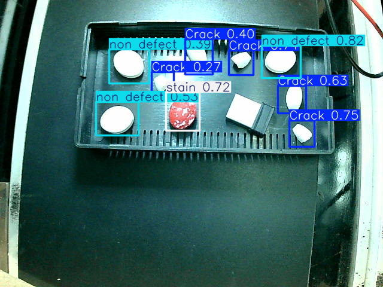

# Pill Defect Detection using YOLO

An AI-powered computer vision system for real-time pill defect detection using **YOLO** and **OpenCV**. The project is designed to identify defective pharmaceutical tablets, such as cracks and stains, to support automated quality inspection in manufacturing environments.

---

## Features

- Real-time pill defect detection
- Detects:
  - Crack
  - Stain
  - Non-Defect
- High-speed inference using YOLO
- Webcam and image/video support
- Easy to extend with additional defect classes

---

## Tech Stack

- Python
- YOLO (Ultralytics)
- OpenCV
- NumPy

---

## Project Structure

```
pill-defect-detection/
│── src/
│   ├── infer.py
│   ├── test.py
│   └── test1.py
│── data.yaml
│── .gitignore
│── README.md
│── output_img.png

```

---

## Dataset

The model was trained on a custom dataset containing three classes:

- Crack
- Stain
- Non-Defect

> **Note:** The dataset is not included in this repository.

---

## Installation

Clone the repository:

```bash
git clone https://github.com/nish-nthm/pill-defect-detection.git
cd pill-defect-detection
```

Install the required packages:

```bash
pip install ultralytics opencv-python numpy
```

---

## Usage

Run inference:

```bash
python src/infer.py
```

Modify the script if you want to use a different image, video, or webcam source.

---

## Results

The model successfully detects pill defects in real time by identifying:

- Crack
- Stain
- Non-Defect

Example Output:


## Future Improvements

- Increase dataset size for better generalization.
- Deploy on edge devices such as NVIDIA Jetson or Raspberry Pi.
- Integrate with industrial conveyor systems.
- Improve performance under varying lighting conditions.

---

## Author

**Nishanth**
GitHub: https://github.com/nish-nthm
